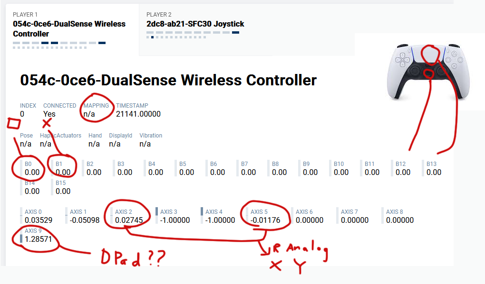
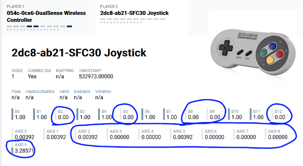
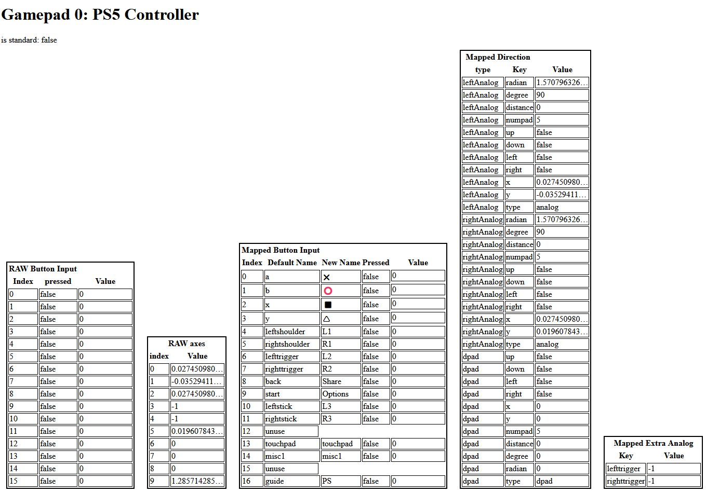
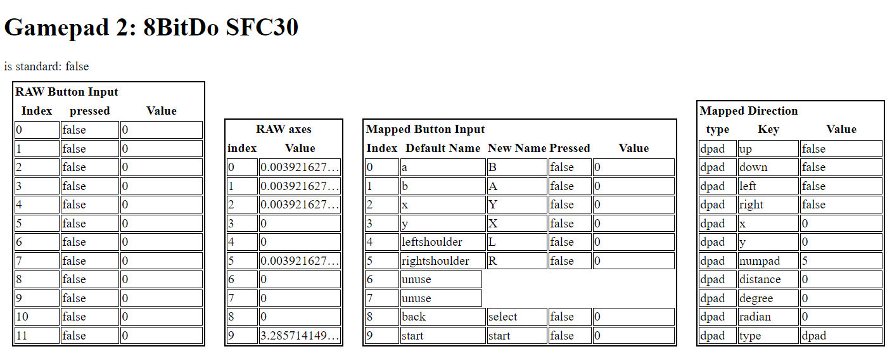
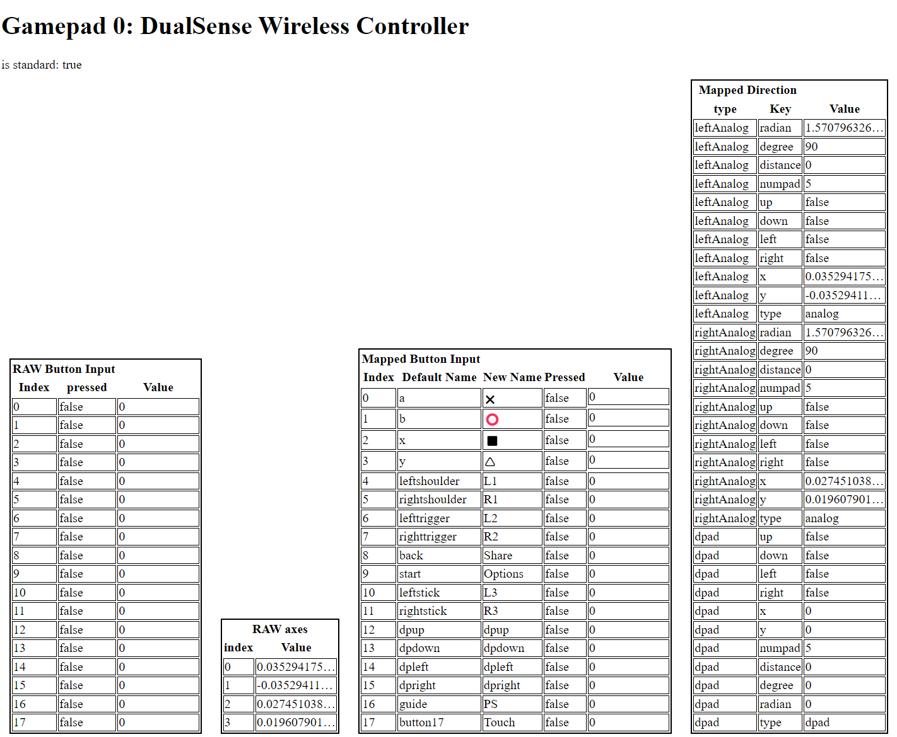

# Gamepad Standardizer

Gamepad Standardizer is a JavaScript library designed to standardize the gamepad input across different browsers and devices. By referencing the 'SDL_GameControllerDB' dataset, this library enables consistent mapping for gamepads that are marked with non-standard mapping in the HTML5 Gamepad API. This makes it easier to understand and use gamepad inputs such as D-pad, left and right analog sticks, regardless of the underlying hardware.

## Features

- Standardizes gamepad mappings across different browsers and devices.
- Simplifies the use of D-pad and analog stick inputs.
- Provides a consistent interface for accessing gamepad information.

## before

 I connected my PS5 controller and 8bitdo's SN30 to my computer using a USB cable and tested them on [hardwaretester](https://hardwaretester.com/gamepad) in both Firefox and Chrome. Neither of them had standard mapping.
Here are the results:

### ps5 @firefox

- FireFox don't ecognize PS5 controller as a standard mapping, everything became a mash
- Normally, B0 is the button on the right side, but now it has become the bottom button (X), which is B1.
- Usually, buttons 12 to 15 are the D-pad, but now buttons 12 and 13 have become the "PS" and "touchpad" buttons.
- The right analog stick is now using axes 2 and 5 (it usually uses axes 2 and 3), and the analog values for L2 and R2 have become axes 3 and 4.
- The D-pad results are combined into a single number at axis 9.

### 8bitdo SNES/SFC 30

- Physically, it has 8 buttons and a D-pad, but the browser detects 13 buttons and 10 axes, with 5 buttons and 8 axes being non-functional (indicated by blue circles).
- Also, there are no actual D-pad buttons; the D-pad is registered as 2 axes.

## after

After using the Gamepad Standardizer from [my demo](https://hocti-demo.s3.ap-southeast-1.amazonaws.com/gamepad_standardizer/demo/demo.html) , here are the results:

### PS5 @firefox

- The mapped button index now follows the [W3C standard](https://www.w3.org/TR/gamepad/#remapping), as returned by `getButtonPress` / `getButtonValue`.
- Unused buttons will return null.
- Buttons have two names: the default name from SDL_GameControllerDB, and a customized emoji name, as returned by `getButtonName`.
- All D-pad and analog inputs are grouped into single Object, returned by `getDirection`.
- Extra analog values (triggers) are returned by `getExtraAnalog`.

### 8bitdo SFC30

- `getDirection` now returns one d-pad only, not analog.
- By using `addbtnNameProfile`, I manually added the new button names, by providing controller's vender and product code.
- unused buttons would return null

### PS5 @ Chrome

- Chrome can recognize the PS5 controller as having standard mapping, so all inputs return normally.
- However, you can still benefit from the D-Pad/Analog result categorization.
- By running all the gamepads through the Gamepad Standardizer, you eliminate the need to worry about whether the mapping is standard or not.
- ✌️


## Installation

```bash
npm install gamepad-standardizer
```
or using jsdelivr
```html
<script src="https://cdn.jsdelivr.net/npm/gamepad_standardizer/dist/gamepad_standardizer.js"></script>
<script>
console.log(gamepad_standardizer)
</script>
```
or
```html
<script type="module">
import * as gamepad_standardizer from "https://cdn.jsdelivr.net/npm/gamepad_standardizer/dist/gamepad_standardizer.esm.js";
console.log(gamepad_standardizer)
</script>
```

## Usage

### Getting Gamepad Information

Retrieve information about a connected gamepad:

```javascript
const gamepadInfo = await getGamepadInfo(navigator.getGamepads()[0]);
console.log(gamepadInfo);
```

### Processing Gamepad Inputs

Get the status of directional inputs from the gamepad:

```javascript
const directionStatus = getDirection(navigator.getGamepads()[0], gamepadInfo);
console.log(directionStatus);
```

### Handling Button Presses

Detect button presses on the gamepad:

```javascript
const buttonPresses = getButtonPress(navigator.getGamepads()[0], gamepadInfo);
console.log(buttonPresses);
```

## API Reference

- `SDLDB_setLink(link: string)`: Sets the link to the SDL database, defaul is SDL_GameControllerDB's github link
- `getGamepadInfo(gamepad: Gamepad)`: Returns information about the connected gamepad.
- `getDirectionAvailable(gamepad: Gamepad, info: gamepadInfo)`: Checks the availability of directional inputs.
- `getDirection(gamepad: Gamepad, info: gamepadInfo, threshold?: number)`: Gets the status of directional inputs, threshold default is 0.1
- `getExtraAnalog(gamepad: Gamepad, info: gamepadInfo)`: Retrieves extra analog inputs.
- `getButtonPress(gamepad: Gamepad, info: gamepadInfo, skipDpad?: boolean)`: Detects button presses.
- `getButtonValue(gamepad: Gamepad, info: gamepadInfo, skipDpad?: boolean)`: Gets the value of button presses.
- `getButtonName(info: gamepadInfo, rename?: boolean)`: Retrieves the names of gamepad buttons.

## Contributing

Contributions to improve Gamepad Standardizer are welcome. Please ensure that your code adheres to the project's coding standards and includes appropriate tests.

## License

Gamepad Standardizer is [MIT licensed](./LICENSE).